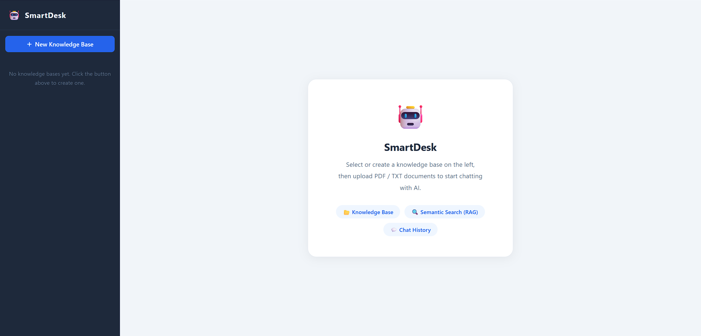
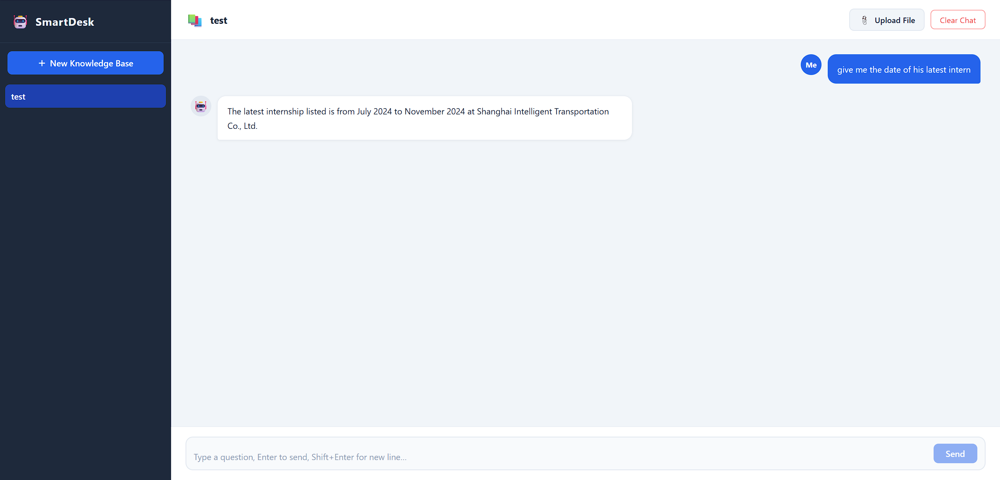

# 🤖 SmartDesk — Enterprise Knowledge Assistant

An AI-powered enterprise knowledge base and customer support assistant built with RAG (Retrieval-Augmented Generation). Upload your documents and get instant, accurate answers powered by Google Gemini — with full user authentication and one-command Docker deployment.

## Screenshots

### Main Interface


### AI-Powered Q&A with Source Citation


## Features

- 📚 **Knowledge Base Management** — Create multiple knowledge bases, each isolated per user
- 📄 **Document Ingestion** — Upload PDF and TXT files; automatically parsed, chunked, and indexed
- 🔍 **RAG Pipeline** — Semantic search with ChromaDB vector storage + Gemini generation
- 🌐 **Tool Use / Web Search** — When documents lack sufficient context, automatically falls back to DuckDuckGo web search
- 🌤️ **Real-Time Weather** — Weather queries fetch live data (temperature, humidity, wind) from wttr.in — no API key needed
- 📝 **Document Auto-Summary** — Generates a 3-5 sentence summary for each uploaded file in the background
- ⚡ **Streaming Responses** — SSE-based token-by-token streaming, like ChatGPT
- 🔗 **Smart Source Citation** — Answers show the exact document or web source used; AI synthesizes naturally without saying "according to search results"
- 🧠 **Multi-Turn Memory** — AI remembers the last 5 messages; classifies follow-ups, format changes, and greetings to route intelligently
- 🌍 **Multilingual** — Responds in whatever language the user writes in; handles language-switch instructions ("reply in Japanese") correctly
- 🔐 **JWT Authentication** — User registration/login with bcrypt password hashing; each user's data is fully isolated
- 🐳 **Docker Deployment** — One-command startup with docker-compose

## Tech Stack

| Layer | Technologies |
|-------|-------------|
| Frontend | Vue 3, Vite, Nginx |
| Backend | Python, FastAPI |
| AI | Google Gemini API (gemini-1.5-flash) |
| Vector DB | ChromaDB (local persistent storage) |
| Database | SQLite |
| Auth | JWT (HS256) + bcrypt |
| Deployment | Docker, docker-compose |

## Quick Start (Docker)

```bash
git clone https://github.com/DaggerLee/smartdesk.git
cd smartdesk
cp .env.example .env        # Add your GEMINI_API_KEY
docker-compose up --build
```

Open http://localhost — register an account and start uploading documents.

## Local Development

### Backend
```bash
cd backend
pip install -r requirements.txt
export GEMINI_API_KEY=your_key_here
uvicorn main:app --reload --port 8000
```

### Frontend
```bash
cd frontend
npm install
npm run dev
```

Open http://localhost:5173

## Architecture

```
User Query
    ↓
Message Classifier (conversational / followup / meta / question)
    ↓
Vue 3 Frontend (Nginx) → FastAPI Backend (JWT Auth)
    ↓
RAG Quality Check (ChromaDB cosine distance threshold)
    ├── Sufficient  → ChromaDB context → Gemini (stream)
    └── Insufficient → Weather query? → wttr.in real-time data
                     → Other query?   → DuckDuckGo web search
                     → Gemini (stream)
    ↓
SSE Stream → [SOURCE_USED] / [WEB_USED] markers → Source Cards
```

## API Endpoints

| Method | Endpoint | Description |
|--------|----------|-------------|
| POST | /api/auth/register | Register new user |
| POST | /api/auth/login | Login, returns JWT |
| GET | /api/knowledge-base | List user's knowledge bases |
| POST | /api/knowledge-base | Create knowledge base |
| POST | /api/knowledge-base/{id}/upload | Upload document |
| DELETE | /api/knowledge-base/{id}/files/{filename} | Delete document |
| POST | /api/chat/stream | RAG chat (streaming SSE) |
| GET | /api/chat/history/{kb_id} | Get conversation history |

## Background
Built to demonstrate production-grade RAG architecture for enterprise knowledge management, inspired by real-world AI assistant integration work during internships at Google Maps and Shanghai Intelligent Transportation.