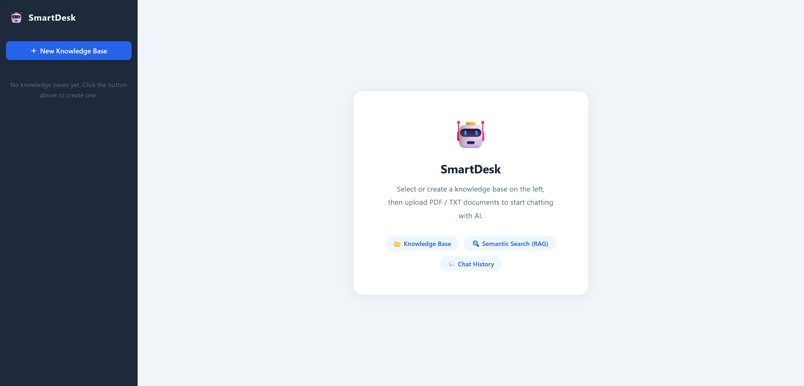
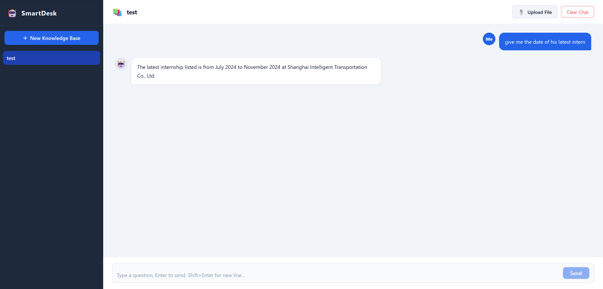

# 🤖 SmartDesk — Enterprise Knowledge Assistant

An AI-powered enterprise knowledge base assistant. Upload documents, get accurate answers grounded in your content — with JWT auth, streaming SSE, and one-command Docker deployment.

## v2: Agentic Knowledge Assistant

SmartDesk now routes requests across `direct`, `rag`, and `agent` paths. The
agent path uses LangGraph orchestration, durable SQLite checkpoints, MCP
tool exposure, groundedness checks, and an API-driven human approval flow for
`write_note`.

**Verified status:** the HITL production cutover passed 258 backend tests,
5 frontend tests, and a 73-module production build. The observed Markdown XSS
was fixed and is guarded by regression tests; its final verification passed
11 frontend tests and a 75-module production build. See
[Project Evidence](docs/PROJECT_EVIDENCE.md) for evidence and limitations.

---

## v1 (baseline) — Screenshots

### Main Interface


### AI-Powered Q&A with Source Citation


## v1 (baseline) — Features

- 📚 **Knowledge Base Management** — Create multiple knowledge bases, each isolated per user
- 📄 **Document Ingestion** — Upload PDF and TXT files; automatically parsed, chunked, and indexed
- 🔍 **RAG Pipeline** — Semantic search with ChromaDB vector storage + Gemini generation
- 🌐 **Tool Use / Web Search** — When documents lack sufficient context, automatically falls back to DuckDuckGo web search
- 🌤️ **Real-Time Weather** — Weather queries fetch live data (temperature, humidity, wind) from wttr.in — no API key needed
- 📝 **Document Auto-Summary** — Generates a 3-5 sentence summary for each uploaded file in the background
- ⚡ **Streaming Responses** — SSE-based token-by-token streaming, like ChatGPT
- 🔗 **Smart Source Citation** — Answers show the exact document or web source used; AI synthesizes naturally without saying "according to search results"
- 🧠 **Multi-Turn Memory** — AI remembers the last 5 messages; classifies follow-ups, format changes, and greetings to route intelligently
- 🌍 **Multilingual** — Responds in whatever language the user writes in; handles language-switch instructions ("reply in Japanese") correctly
- 🔐 **JWT Authentication** — User registration/login with bcrypt password hashing; each user's data is fully isolated
- 🐳 **Docker Deployment** — One-command startup with docker-compose

## v1 (baseline) — Tech Stack

| Layer | Technologies |
|-------|-------------|
| Frontend | Vue 3, Vite, Nginx |
| Backend | Python, FastAPI |
| AI | Google Gemini API |
| Vector DB | ChromaDB (local persistent storage) |
| Database | SQLite |
| Auth | JWT (HS256) + bcrypt |
| Deployment | Docker, docker-compose |

## Quick Start (Docker) — works for both v1 and v2

```bash
git clone https://github.com/DaggerLee/smartdesk.git
cd smartdesk
cp .env.example .env        # Add your GEMINI_API_KEY
docker-compose up --build
```

Open http://localhost — register an account and start uploading documents.

## Local Development

### Backend
```bash
cd backend
pip install -r requirements.txt
export GEMINI_API_KEY=your_key_here
uvicorn main:app --reload --port 8000
```

### Frontend
```bash
cd frontend
npm install
npm run dev
```

Open http://localhost:5173

## v1 Baseline Architecture

```
User Query
    ↓
Message Classifier (conversational / followup / meta / question)
    ↓
Vue 3 Frontend (Nginx) → FastAPI Backend (JWT Auth)
    ↓
RAG Quality Check (ChromaDB cosine distance threshold)
    ├── Sufficient  → ChromaDB context → Gemini (stream)
    └── Insufficient → Weather query? → wttr.in real-time data
                     → Other query?   → DuckDuckGo web search
                     → Gemini (stream)
    ↓
SSE Stream → [SOURCE_USED] / [WEB_USED] markers → Source Cards
```

## v1 (baseline) — API Endpoints

| Method | Endpoint | Description |
|--------|----------|-------------|
| POST | /api/auth/register | Register new user |
| POST | /api/auth/login | Login, returns JWT |
| GET | /api/knowledge-base | List user's knowledge bases |
| POST | /api/knowledge-base | Create knowledge base |
| DELETE | /api/knowledge-base/{kb_id} | Delete knowledge base |
| GET | /api/knowledge-base/{kb_id}/files | List knowledge-base files |
| POST | /api/knowledge-base/{id}/upload | Upload document |
| DELETE | /api/knowledge-base/{id}/files/{filename} | Delete document |
| POST | /api/chat/stream | Routed chat (streaming SSE) |
| POST | /api/chat/actions/{thread_id}/resolve | Approve, edit, or reject and resume a pending write |
| GET | /api/chat/history/{kb_id} | Get conversation history |

## MCP Server

SmartDesk exposes its tool layer as an MCP server (`backend/mcp_server/server.py`) using FastMCP, so any MCP-compatible client (Claude Desktop, Claude Code, custom agents) can call **retrieve** and **web_search** directly.

### Tools

| Tool | Parameters | Description |
|---|---|---|
| `retrieve` | `kb_id: int`, `query: str` | Semantic search over a SmartDesk knowledge base (ChromaDB). Returns `chunks`, `evidence`, and `relevance_ok`. |
| `web_search` | `query: str`, `num_results: int = 5` | DuckDuckGo search. Returns `results` and `evidence`. |

Both tools follow the SmartDesk **evidence protocol**: every result includes an `evidence` list of `{"text": str, "source": str}` for citation and groundedness checking.

### Registering in Claude Desktop

Add to `~/Library/Application Support/Claude/claude_desktop_config.json` (macOS) or `%APPDATA%\Claude\claude_desktop_config.json` (Windows):

```json
{
  "mcpServers": {
    "smartdesk": {
      "command": "python3",
      "args": ["-m", "mcp_server.server"],
      "cwd": "/absolute/path/to/smartdesk/backend"
    }
  }
}
```

### Registering in Claude Code

Add to `.claude/settings.json` in your workspace:

```json
{
  "mcpServers": {
    "smartdesk": {
      "command": "python3",
      "args": ["-m", "mcp_server.server"],
      "cwd": "/absolute/path/to/smartdesk/backend",
      "type": "stdio"
    }
  }
}
```

### Running standalone

```bash
cd backend
pip install -r requirements.txt   # includes fastmcp>=3.0
python3 -m mcp_server.server      # stdio server, ready for any MCP client
```

---

## Background
Built to demonstrate production-grade RAG architecture for enterprise knowledge management, inspired by real-world AI assistant integration work during internships at Google Maps and Shanghai Intelligent Transportation.