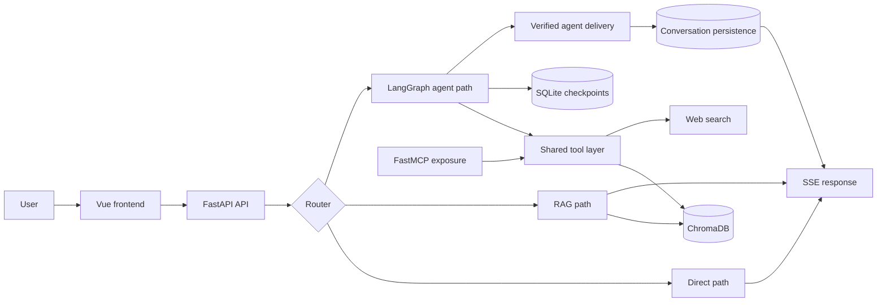
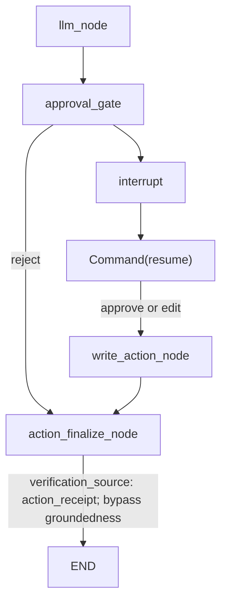

# SmartDesk Portfolio README Implementation Plan

> **For agentic workers:** REQUIRED SUB-SKILL: Use superpowers:subagent-driven-development (recommended) or superpowers:executing-plans to implement this plan task-by-task. Steps use checkbox (`- [ ]`) syntax for tracking.

**Goal:** Replace SmartDesk's stale public README with an accurate, evidence-backed portfolio presentation without changing product behavior.

**Architecture:** The implementation changes `README.md` only and preserves two independently reviewable commits. Commit A corrects stale facts and instructions; Commit B adds the portfolio narrative and two Mermaid diagrams. GitHub About and Topics remain a separate repository-metadata operation after README acceptance.

**Tech Stack:** GitHub-flavored Markdown, Mermaid, Git, GitHub repository metadata, existing SmartDesk evidence and Python/Vue/FastAPI/LangGraph source.

## Global Constraints

- Start from branch `codex/portfolio-readme` after design commit `fa1d91d`.
- `docs/PROJECT_EVIDENCE.md` owns every public number and verified outcome.
- Do not recompute, infer, round, or strengthen any public metric.
- Commit A changes `README.md` for accuracy only and must remain independently mergeable.
- Commit B changes `README.md` for portfolio presentation only.
- Do not modify product code, configuration, dependencies, tests, eval data, screenshots, or generated assets.
- Use Mermaid in `README.md`; do not add PNG, SVG, GIF, or screenshot files.
- Keep Contributors untouched and do not describe CC, Codex, Claude Code, or any other AI tool as a human contributor.
- Treat all 50 untracked files under `backend/eval/results/` as user-owned; do not modify, delete, stage, or commit them.
- Do not modify tracked `backend/eval/results/history.jsonl`.
- Do not add anything from Git-ignored `docs-local/` to Git.
- Do not call Gemini or any paid model API.
- Do not fix approval UI, narrow-screen layout, stream interruption, paused-flow refresh, or any other backlog item.
- GitHub About and Topics are repository metadata, not Git content; never report them as committed.
- Do not push or merge until the human separately authorizes those actions.

## Public Evidence Ledger

Copy only these figures into the README, with the stated limitations:

| README claim | Semantic owner |
|---|---|
| 35-item evaluation set | `docs/PROJECT_EVIDENCE.md`, EV-001 |
| Router accuracy 91.7%, end-to-end contains pass 94.4%, grounded rate 88%, zero execution errors | `docs/PROJECT_EVIDENCE.md`, EV-001 |
| 258 backend tests, 5 frontend tests, 73-module production build for HITL cutover | `docs/PROJECT_EVIDENCE.md`, EV-005 |
| One local and one Docker real-model HITL success; exact token and monetary cost unknown | `docs/PROJECT_EVIDENCE.md`, EV-005 |
| 11 frontend tests and 75-module production build for the Markdown XSS correction | `docs/PROJECT_EVIDENCE.md`, EV-006 |
| Observed Markdown XSS fixed and guarded by regression tests | `docs/PROJECT_EVIDENCE.md`, EV-006 |
| XSS implementation `56d4fc3`, boundary guard `9d7e889`, rendering contract `29bac52`, PR #3 / merge `1a026c4` | `docs/PROJECT_EVIDENCE.md`, EV-006 |

Retain these limitations in plain language:

- Historical LLM evaluation numbers are baseline evidence, not current statistical guarantees.
- The live HITL evidence is one local and one Docker success, not a three-run evaluation.
- Browser terminal-state acceptance used a deterministic zero-Gemini API, not a live-model browser round trip.
- Token and monetary cost are unknown, never zero.
- SQLite checkpointing is a single-process/demo constraint.
- Approval remains API-only.
- The XSS work is a focused rendering fix, not a full security audit, CSP rollout, or backend sanitization framework.

---

### Task 1: Commit A — Correct stale README facts

**Files:**
- Modify: `README.md`
- Read only: `docs/PROJECT_EVIDENCE.md`
- Read only: `backend/config.py`
- Read only: `backend/routers/chat.py`
- Read only: `backend/agent/graph.py`
- Read only: `backend/mcp_server/server.py`
- Protect: `backend/eval/results/*`

**Interfaces:**
- Consumes: the Public Evidence Ledger above and current route/config names from source.
- Produces: one accuracy-only README commit with no portfolio diagram or promotional rewrite.

- [ ] **Step 1: Reconfirm the protected starting state**

Run:

```bash
cd /home/dagger306/projects/smartdesk
git branch --show-current
git rev-parse HEAD
git status --porcelain=v1 --untracked-files=no
git status --porcelain=v1 --untracked-files=all -- backend/eval/results
git diff --quiet -- backend/eval/results/history.jsonl
```

Expected:

- branch is `codex/portfolio-readme`;
- HEAD includes design commit `fa1d91d`;
- tracked worktree is clean;
- exactly 50 user-owned eval files are untracked;
- `history.jsonl` has no diff.

- [ ] **Step 2: Build an evidence-to-copy checklist before editing**

Run:

```bash
grep -nE '35-item|91\.7%|94\.4%|88%|258 backend|5 frontend|73 modules|11 frontend|75 transformed|one local|one Docker|unknown' docs/PROJECT_EVIDENCE.md
grep -nE 'AGENT_BACKEND_DEFAULT|HITL_WRITE_NOTE_DEFAULT' backend/config.py
grep -nE '@router\.(post|get|delete)' backend/routers/chat.py backend/routers/knowledge_base.py backend/routers/auth.py
```

Expected:

- every planned number appears in `docs/PROJECT_EVIDENCE.md`;
- current defaults are `langgraph` and HITL enabled;
- the action resolution endpoint is `/api/chat/actions/{thread_id}/resolve`.

- [ ] **Step 3: Make accuracy-only corrections in `README.md`**

Apply these exact content rules:

1. Change `## v2: Agentic Upgrade (in progress)` to `## v2: Agentic Knowledge Assistant`.
2. Remove `W2 in progress`, `17 unit tests`, and `Full architecture docs and eval results coming with v2.0`.
3. Replace the stale progress paragraph with a factual status block:

```markdown
SmartDesk now routes requests across `direct`, `rag`, and `agent` paths. The
agent path uses LangGraph orchestration, durable SQLite checkpoints, MCP
tool exposure, groundedness checks, and an API-driven human approval flow for
`write_note`.

**Verified status:** the HITL production cutover passed 258 backend tests,
5 frontend tests, and a 73-module production build. The observed Markdown XSS
was fixed and is guarded by regression tests; its final verification passed
11 frontend tests and a 75-module production build. See
[Project Evidence](docs/PROJECT_EVIDENCE.md) for evidence and limitations.
```

4. In the technology table, replace `gemini-1.5-flash` with
   `Google Gemini API` so the README does not duplicate the centrally owned
   exact model setting.
5. Replace the stale link to `CLAUDE.md#v2-target-architecture` with
   `[Project Evidence](docs/PROJECT_EVIDENCE.md)`.
6. Keep the existing screenshots, Quick Start, local development commands,
   baseline feature list, and MCP registration instructions unless a
   source-backed factual correction is required.
7. Rename the ASCII section to `## v1 Baseline Architecture` so it is not
   presented as the current v2 topology.
8. Correct the API table:
   - describe `/api/chat/stream` as routed SSE chat, not RAG-only chat;
   - add `POST /api/chat/actions/{thread_id}/resolve` as the API-only
     approve/edit/reject resume endpoint;
   - add any currently implemented knowledge-base list/delete endpoints only
     when their exact path is confirmed in `backend/routers/knowledge_base.py`.
9. Do not add Mermaid, recruiter framing, an evidence table, a security
   narrative, new badges, or GitHub metadata in Commit A.

- [ ] **Step 4: Run the accuracy gate**

Run:

```bash
cd /home/dagger306/projects/smartdesk
! grep -nE 'W2 in progress|17 unit tests|gemini-1\.5-flash|Full architecture docs and eval results coming' README.md
grep -nE '258 backend tests|5 frontend tests|73-module|11 frontend tests|75-module' README.md
grep -nE '258 backend tests|5 frontend tests|73 modules|11 frontend tests|75 transformed modules' docs/PROJECT_EVIDENCE.md
grep -nF 'POST | /api/chat/actions/{thread_id}/resolve' README.md
git diff --check -- README.md
```

Expected:

- no stale progress or model statements remain;
- README figures have direct matching evidence lines;
- the current action resolution endpoint is documented;
- the README diff has no whitespace errors.

- [ ] **Step 5: Validate all repository-local README links**

Run:

```bash
cd /home/dagger306/projects/smartdesk
python - <<'PY'
import pathlib
import re

root = pathlib.Path(".")
text = pathlib.Path("README.md").read_text(encoding="utf-8")
targets = re.findall(r"!?\[[^\]]*\]\(([^)]+)\)", text)
missing = []
for raw in targets:
    target = raw.split("#", 1)[0]
    if not target or target.startswith(("http://", "https://", "mailto:")):
        continue
    if not (root / target).exists():
        missing.append(raw)
if missing:
    raise SystemExit(f"Missing local README links: {missing}")
print("README local links resolve")
PY
```

Expected: `README local links resolve`.

- [ ] **Step 6: Review and commit only Commit A**

Run:

```bash
cd /home/dagger306/projects/smartdesk
git diff -- README.md
git add -- README.md
git diff --cached --name-status
git diff --cached --check
git commit -m "docs: correct stale README claims"
git show --stat --oneline HEAD
```

Expected:

- the staged and committed file list contains only `README.md`;
- the diff contains factual corrections only;
- commit message is `docs: correct stale README claims`.

---

### Task 2: Commit B — Add the portfolio presentation

**Files:**
- Modify: `README.md`
- Read only: `docs/PROJECT_EVIDENCE.md`
- Read only: `backend/agent/graph.py`
- Protect: `backend/eval/results/*`

**Interfaces:**
- Consumes: the accurate README from Commit A and the evidence ledger above.
- Produces: one portfolio-only README commit with Mermaid diagrams, verified highlights, limitations, and evidence navigation.

- [ ] **Step 1: Add the 30-second portfolio opening**

Place these sections before the existing screenshots and detailed reference
material:

```markdown
# SmartDesk — Verified Enterprise Knowledge Assistant

SmartDesk is a portfolio-grade knowledge assistant that combines routed RAG,
LangGraph agent workflows, MCP-exposed tools, measurable evaluation, and an
API-driven human approval path for persistent writes.

## Why This Project

The project focuses on a practical engineering question: how can an AI
assistant use tools and take approved actions without letting checked,
persisted, and user-visible results drift apart?

## Verified Highlights
```

Under `Verified Highlights`, add a compact table with these rows:

- measurable baseline — 35-item set; 91.7% router accuracy; 94.4%
  end-to-end contains pass; 88% grounded rate; zero execution errors;
- HITL cutover — 258 backend tests; 5 frontend tests; 73-module build;
- real-model write closure — one local and one Docker success; cost unknown;
- Markdown XSS — fixed and guarded by regression tests; 11 frontend tests;
  75-module build.

Each row must link to `[Project Evidence](docs/PROJECT_EVIDENCE.md)` and retain
the evidence limitations below the table.

- [ ] **Step 2: Add the current system Mermaid diagram**

Use this diagram:



Immediately below it, state:

- LangGraph owns workflow orchestration.
- FastMCP exposes the tool layer; it is not presented as the graph engine.
- SQLite checkpoints are the current single-process/demo durability model.
- Verified agent delivery commits the canonical answer before SSE emission.

- [ ] **Step 3: Add the exact HITL Mermaid path**

Use this diagram:



Add this plain-language explanation:

```markdown
The graph pauses before the file write. Approval or an edited payload resumes
the write path; rejection skips the write. Both outcomes finalize from the
action receipt, and write claims do not pass through the ordinary answer
groundedness path.
```

- [ ] **Step 4: Add engineering decisions, security wording, and limitations**

Add concise sections with these exact boundaries:

```markdown
## Engineering Decisions

- Route simple, retrieval, and tool-using requests separately.
- Keep LangGraph orchestration separate from MCP tool exposure.
- Persist the canonical verified agent answer before emitting it.
- Require a committed action receipt as the source for write claims.
- Keep public claims tied to the append-only project evidence log.

## Focused Security Correction

The observed Markdown XSS was fixed and is guarded by regression tests.
DOMPurify now protects the single AI Markdown rendering boundary. This was a
focused frontend correction, not a full security audit, CSP rollout, or
backend sanitization framework.

## Current Limitations

- Human approval is API-only; there are no browser approval controls.
- SQLite checkpointing targets a single-process/demo deployment.
- Live HITL evidence is one local and one Docker success, not a three-run
  evaluation.
- Browser terminal-state acceptance used a deterministic zero-Gemini API.
- Exact token and monetary cost are unknown.
```

Add an `Evidence Index` that names EV-001 through EV-006 and links once to
`[Project Evidence](docs/PROJECT_EVIDENCE.md)`. Do not invent separate anchor
URLs.

- [ ] **Step 5: Preserve the detailed project reference**

Keep or move below the portfolio summary:

- existing screenshots;
- feature list;
- technology table;
- Quick Start and local development;
- API endpoint table;
- MCP server usage and registration;
- project background.

Do not add a Contributors section. Do not name an AI tool as an author,
maintainer, engineer, or human contributor.

- [ ] **Step 6: Verify the evidence and topology**

Run:

```bash
cd /home/dagger306/projects/smartdesk
grep -nE '35-item|91\.7%|94\.4%|88%|258 backend tests|5 frontend tests|73-module|11 frontend tests|75-module|unknown' README.md
grep -nE '35-item|91\.7%|94\.4%|88%|258 backend tests|5 frontend tests|73 modules|11 frontend tests|75 transformed modules|unknown' docs/PROJECT_EVIDENCE.md
grep -nE 'approval_gate|write_action_node|action_finalize_node|groundedness_node|add_edge|add_conditional_edges' backend/agent/graph.py
grep -nE 'llm_node|approval_gate|interrupt|Command\(resume\)|write_action_node|action_finalize_node|END|action_receipt' README.md
! grep -nE 'W2 in progress|17 unit tests' README.md
grep -nF 'not a full security audit, CSP rollout, or' README.md
! grep -nF 'fully security-audited' README.md
! grep -nE '^## Contributors|^### Contributors' README.md
git diff --check -- README.md
```

Expected:

- every README number has an evidence counterpart;
- no stale progress claims remain;
- the Mermaid path matches the real graph edges;
- rejection goes directly from `approval_gate` to `action_finalize_node`;
- the action receipt path explicitly bypasses ordinary groundedness;
- no Contributors section or overstated security claim exists;
- whitespace validation passes.

- [ ] **Step 7: Re-run repository-local link validation**

Run the exact Python link-check command from Task 1, Step 5.

Expected: `README local links resolve`.

- [ ] **Step 8: Review Commit B independently**

Run:

```bash
cd /home/dagger306/projects/smartdesk
git diff -- README.md
git show --format=fuller HEAD -- README.md
git status --short
```

Expected:

- the working diff contains only portfolio presentation changes;
- Commit A remains a complete accuracy correction without depending on this
  diff;
- only `README.md` is a tracked change;
- the 50 eval artifacts remain untracked and unchanged.

- [ ] **Step 9: Commit only Commit B**

Run:

```bash
cd /home/dagger306/projects/smartdesk
git add -- README.md
git diff --cached --name-status
git diff --cached --check
git commit -m "docs: present verified SmartDesk portfolio"
git show --stat --oneline HEAD
git show --stat --oneline HEAD^
```

Expected:

- Commit B contains only `README.md`;
- commit message is `docs: present verified SmartDesk portfolio`;
- Commit A and Commit B are two separate, independently reviewable diffs.

---

### Task 3: Human rendering acceptance and GitHub metadata

**Files:**
- Modify: none
- Inspect: `README.md` through GitHub's README renderer
- External metadata: GitHub About description and Topics

**Interfaces:**
- Consumes: accepted Commit A and Commit B.
- Produces: human rendering evidence and repository metadata; neither is a Git commit.

- [ ] **Step 1: Obtain authorization before publishing the branch**

Do not push as part of this plan unless the human explicitly authorizes it.
After authorization, push the existing branch without merging:

```bash
cd /home/dagger306/projects/smartdesk
git push -u origin codex/portfolio-readme
```

Expected: the remote branch points to Commit B and `main` is unchanged.

- [ ] **Step 2: Perform the human GitHub README rendering check**

Open the branch README on GitHub and verify:

- both Mermaid diagrams render without syntax errors;
- diagram labels are readable in light and dark themes;
- tables do not overflow at normal desktop width;
- local links and screenshots open;
- the first screen explains the problem, verified outcome, and limitations;
- no Contributors section was introduced.

Record the human result as browser acceptance. If a correction is required
before merge, amend Commit B so the implementation still has exactly two
README commits, then rerun Task 2 verification.

- [ ] **Step 3: Update GitHub About as a separate metadata operation**

After README acceptance, set the About description to:

```text
Enterprise knowledge assistant with routed RAG, LangGraph workflows, MCP tools, verified delivery, evaluation, and API-driven HITL writes.
```

This changes GitHub repository metadata only. Do not stage a file and do not
describe the change as committed.

- [ ] **Step 4: Update GitHub Topics as a separate metadata operation**

Set exactly this initial topic set:

```text
rag
langgraph
fastapi
vue
human-in-the-loop
llm-evaluation
mcp
```

Leave GitHub Contributors untouched. Verify the repository page shows the
description and Topics, then run:

```bash
cd /home/dagger306/projects/smartdesk
git status --short
```

Expected: Git metadata operations produce no working-tree change.

---

### Task 4: Final delivery audit

**Files:**
- Modify: none
- Inspect: Git history, `README.md`, protected eval state

**Interfaces:**
- Consumes: both README commits and optional human/browser metadata evidence.
- Produces: a factual merge-readiness report without merging.

- [ ] **Step 1: Prove the two README commit boundaries**

Run:

```bash
cd /home/dagger306/projects/smartdesk
git log -3 --oneline
git show --format=fuller --stat HEAD
git show --format=fuller --stat HEAD^
git diff HEAD^^..HEAD^ -- README.md
git diff HEAD^..HEAD -- README.md
```

Expected:

- design governance remains a separate earlier commit;
- Commit A contains accuracy corrections only;
- Commit B contains portfolio presentation only.

- [ ] **Step 2: Prove protected data remained untouched**

Run:

```bash
cd /home/dagger306/projects/smartdesk
git diff --quiet -- backend/eval/results/history.jsonl
git status --porcelain=v1 --untracked-files=all -- backend/eval/results
git status --porcelain=v1 --untracked-files=no
```

Expected:

- `history.jsonl` has no diff;
- the same 50 user-owned eval artifacts remain untracked;
- tracked worktree is clean.

- [ ] **Step 3: Report the real final state**

Report:

- Commit A SHA and message;
- Commit B SHA and message;
- evidence and link checks;
- human GitHub README rendering result;
- About and Topics result as metadata, not commits;
- protected eval status;
- whether the branch was pushed;
- explicitly state that no merge occurred unless a later human instruction
  authorized and verified one.
